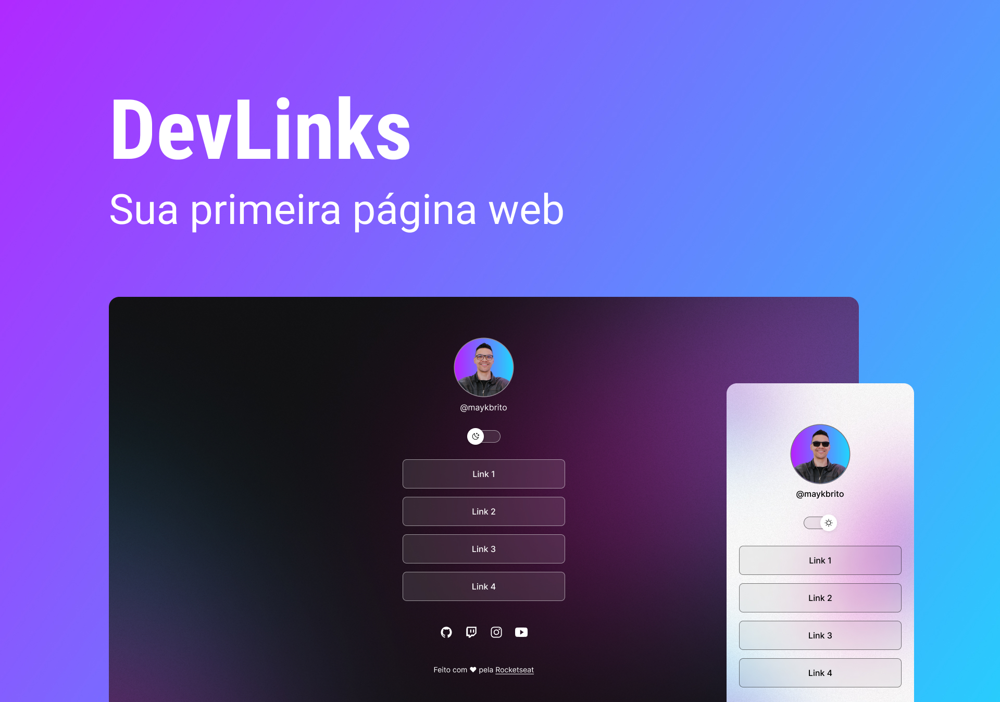

<h1 align="left">Hi , I'm Andre Marques</h1>

 
 

- 🔥 Student Program

- 🔭 I’m currently working at accounting office

- 💬 I'm learning about **JavaScript, HTML, CSS, SQL, Node.JS, Figma**

- 👨‍💻 More at @Almarquest

## Projects

O DevLinks is a agregator for links.

## Layout

Voce pode visualizar o layout do projeto atraves [DESSE LINK] (https://www.figma.com/file/eRSI9xTRLsFuek3VWgYXf9/DevLinks-(Community)?node-id=0%3A1&t=n2MZ1vft3NY6xi5n-0). E necessario ter conta no [Figma](https://figma.com/) para acessa-lo.

<!--

  

## 🛠 &nbsp;Tech Stack

&nbsp;
&nbsp;
&nbsp;
&nbsp;
&nbsp;
&nbsp;
&nbsp;
&nbsp;
&nbsp;
&nbsp;
&nbsp;

  

## ⚙️ &nbsp;GitHub Analytics

-->

  

## Contact

